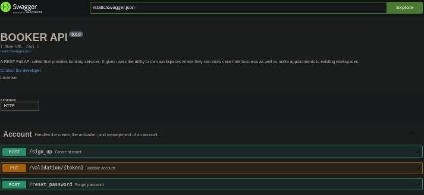

# BOOKER API

<center>


</center>

<hr>

https://github.com/jinDeHao/Booker/assets/70861727/377e923d-5bc4-438e-b8b1-c4e12afb5068


## TABLE OF CONTENT
- [Booker explained](#booker-explained)
- [Inspiration](#booker-explained)
- [User stories](#user-stories)
- [Functional requirements](#functional-requirements)
- [Features](#features)
- [Technical specifications](#technical-specifications)
- [Modeling and conception](#modeling-and-conception)
- [Development](#development)
- [Clonning and setup](#clonning-and-setup)
- [Conclusion](#conlusion)
- [Contact](#contact)

## Booker explained

While a random person, in a random area, was struggling with a random illness, they decided to visit a random doctor to end the suffering. The trip to the clinic lasted about 2 hours, which made their health situation even worse.

When the person arrived, to their surprise, a long queue of people waiting to get an appointment to see the doctor, the person waited for what seemed like infinite time, then got an appointment, The person had to hit the road one more time back home until the appointment's date.

This is a typical situation for getting an appointment, thus my partner and I decided to go on a journey to tackle this continuous problem. We introduce `BOOKER`.

Booker is a restful API, that provides booking services and allows industries to create working spaces where their clients can book appointments remotely.

Booker is amazing because it gives great developers the chance to create an interface based on what they think fits their client's needs. The developers can take our API and use it for their purposes. The goal was to have an API with simple endpoints that handle different tasks done by regular users that are able to create appointments, and premium users that can own a workspace where to showcase their services and receive appointments, and the administration that handles all the management.

We see Booker as more than just a Restful API; we see it as the future, as it can be used in amazing inventions, and that’s the plan.

## User stories

> As a user, I want to be able to create a new booking or a workspace for my professional activities, view all my bookings and workspaces. Update, cancel, or delete existing ones, and also search for available workspaces based on location, amenities, and availability.

> As a meticulous user, I want to receive confirmation emails for successful bookings.

> As a small business owner, I have been struggling to handle client's requests since they call me on my mobile to book appointments. I haven’t been able to hire an assistant to handle such tasks for me since I have just launched my business, and am not yet able to afford hiring a new employee. With Booker, I pay an affordable monthly fee, and Booker handles client bookings for me. I have a dashboard where I can keep track of the appointments taken, and it gives me the flexibility and the freedom to focus on the work that I do to deliver the best service.

## Functional requirements
Booker provides booking services for users, and workspaces for different industries that occupy various fields.

- User authentication: Users can sign up and manage their accounts. For a user to have access to start creating workspaces, they have to register as a premium user and set up payment information.
- User navigation: Users can navigate through available workspaces, filter based on their demand, and get appointments. Premium users have the right to create workspaces and personalize them based on their schedule and availability.
- Appointment: The user wanting to make an appointment can filter using multiple fields, and then select the proper date based on their availability.
- Developers: As we are working on creating a RESTFUL API, we will ensure that our endpoints are clear for developers to use despite their level of understanding of the API.

## Technical specifications


## Features

- Authentication
	- Signing up
	- Log in
	- Login out
- Account management
	- Account validation
	- Account upgrade
	- Account deletion
- Profile management
	- Showing profile
	- Updating profile
- Appointment management
	- Creating appointments
	- Listing appointments
	- Canceling appointments
- Workspace management
	- Creating workspace
	- Updating workspace
	- Deleting workspace
	- Listing workspaces
	- Filtering workspaces
- Reviews management
	- Creating review
	- Updating review
	- Liking review
	- Disliking review
	- Deleting review
- Reclaims management
	- Sending reclaim
	- Listing reclaims
- Administration
	- The administration is available for a couple of features so far, and it is under construction.

## Modeling and conception
We have chosen to use the UML (unified modeling language) since it is known for its fitted nature to oriented object programming. It helped us a lot to include this step, and was crucial to some extend.

https://github.com/jinDeHao/Booker/assets/70861727/cfc5d3f0-e458-494f-a6ab-263fadfd7eea

You can access the UML folder to check out the diagrams separately and go through each.

With UML we were able to create different diagrams each fitted for a purpose starting with the `Use case diagram`.

#### Use case diagram


#### Class diagram


#### Sequence diagram
One example of the use case diagram would be post and get appointment.


The rest of the user sequence diagrams are here [sequence diagrams](/Booker/UML/Sequence_diagram/)

## Development
We created endpoints for every feature. And we have used Swagger to showcase every one of them.



Of course, we had to review each other's code, and here's what Omar did.

https://github.com/jinDeHao/Booker/assets/70861727/7cf864dd-709e-4c1d-bd96-c3c9880a6351

## Issues
We did face some issues, we had to update the class diagram, It was a learning curve for us. We learned a lot about how to do things the right way.

https://github.com/jinDeHao/Booker/assets/70861727/08db38cc-3d54-43a4-86ee-35101b04d87c

## Cloning and setup
To test what we have created try to follow this guide:

Cloning the repository
```bash
git clone https://github.com/jinDeHao/Booker.git
```
Navigate to the project
```bash
cd /Booker/API
```

Install the required dependencies
```bash
pip3 install requirements.txt
```

Run the API
```bash
python3 -m run
```

## Conlusion
We had so much fun while working on this project, each time we would refine and update what we have done. We have more to work on but this is the initial version of the API. We would be happy if developers used it to creat interfaces.
By the way bellow is a meme about our collaboration, it was a fun battle.

https://github.com/jinDeHao/Booker/assets/70861727/f274584c-3b7a-476e-b285-a0bfd2d5968e

## Contact
For any ideas or constructive criticism feel free to contact us in our socials.


Asmaa HADAR

<a href="asmaehadar32@gmail.com">
	<svg xmlns="http://www.w3.org/2000/svg" x="0px" y="0px" width="32%" height="50" viewBox="0 0 48 48">
	<path fill="#4caf50" d="M45,16.2l-5,2.75l-5,4.75L35,40h7c1.657,0,3-1.343,3-3V16.2z"></path><path fill="#1e88e5" d="M3,16.2l3.614,1.71L13,23.7V40H6c-1.657,0-3-1.343-3-3V16.2z"></path><polygon fill="#e53935" points="35,11.2 24,19.45 13,11.2 12,17 13,23.7 24,31.95 35,23.7 36,17"></polygon><path fill="#c62828" d="M3,12.298V16.2l10,7.5V11.2L9.876,8.859C9.132,8.301,8.228,8,7.298,8h0C4.924,8,3,9.924,3,12.298z"></path><path fill="#fbc02d" d="M45,12.298V16.2l-10,7.5V11.2l3.124-2.341C38.868,8.301,39.772,8,40.702,8h0 C43.076,8,45,9.924,45,12.298z"></path>
	</svg>
</a>
<a href="https://twitter.com/HadarAsmaa">
	<svg xmlns="http://www.w3.org/2000/svg" x="0px" y="0px" width="32%" height="50" viewBox="0 0 48 48">
		<path fill="#03A9F4" d="M42,12.429c-1.323,0.586-2.746,0.977-4.247,1.162c1.526-0.906,2.7-2.351,3.251-4.058c-1.428,0.837-3.01,1.452-4.693,1.776C34.967,9.884,33.05,9,30.926,9c-4.08,0-7.387,3.278-7.387,7.32c0,0.572,0.067,1.129,0.193,1.67c-6.138-0.308-11.582-3.226-15.224-7.654c-0.64,1.082-1,2.349-1,3.686c0,2.541,1.301,4.778,3.285,6.096c-1.211-0.037-2.351-0.374-3.349-0.914c0,0.022,0,0.055,0,0.086c0,3.551,2.547,6.508,5.923,7.181c-0.617,0.169-1.269,0.263-1.941,0.263c-0.477,0-0.942-0.054-1.392-0.135c0.94,2.902,3.667,5.023,6.898,5.086c-2.528,1.96-5.712,3.134-9.174,3.134c-0.598,0-1.183-0.034-1.761-0.104C9.268,36.786,13.152,38,17.321,38c13.585,0,21.017-11.156,21.017-20.834c0-0.317-0.01-0.633-0.025-0.945C39.763,15.197,41.013,13.905,42,12.429">
		</path>
	</svg>
</a>
<a href="https://www.linkedin.com/in/asmaa-hadar-928b121a3/">
	<svg xmlns="http://www.w3.org/2000/svg" x="0px" y="0px" width="32%" height="50" viewBox="0 0 48 48">
	<path fill="#0288D1" d="M42,37c0,2.762-2.238,5-5,5H11c-2.761,0-5-2.238-5-5V11c0-2.762,2.239-5,5-5h26c2.762,0,5,2.238,5,5V37z"></path><path fill="#FFF" d="M12 19H17V36H12zM14.485 17h-.028C12.965 17 12 15.888 12 14.499 12 13.08 12.995 12 14.514 12c1.521 0 2.458 1.08 2.486 2.499C17 15.887 16.035 17 14.485 17zM36 36h-5v-9.099c0-2.198-1.225-3.698-3.192-3.698-1.501 0-2.313 1.012-2.707 1.99C24.957 25.543 25 26.511 25 27v9h-5V19h5v2.616C25.721 20.5 26.85 19 29.738 19c3.578 0 6.261 2.25 6.261 7.274L36 36 36 36z"></path>
	</svg>
</a>


Omar IDHMAID

<a href="o.idhmaid@gmail.com">
	<svg xmlns="http://www.w3.org/2000/svg" x="0px" y="0px" width="32%" height="50" viewBox="0 0 48 48">
	<path fill="#4caf50" d="M45,16.2l-5,2.75l-5,4.75L35,40h7c1.657,0,3-1.343,3-3V16.2z"></path><path fill="#1e88e5" d="M3,16.2l3.614,1.71L13,23.7V40H6c-1.657,0-3-1.343-3-3V16.2z"></path><polygon fill="#e53935" points="35,11.2 24,19.45 13,11.2 12,17 13,23.7 24,31.95 35,23.7 36,17"></polygon><path fill="#c62828" d="M3,12.298V16.2l10,7.5V11.2L9.876,8.859C9.132,8.301,8.228,8,7.298,8h0C4.924,8,3,9.924,3,12.298z"></path><path fill="#fbc02d" d="M45,12.298V16.2l-10,7.5V11.2l3.124-2.341C38.868,8.301,39.772,8,40.702,8h0 C43.076,8,45,9.924,45,12.298z"></path>
	</svg>
</a>
<a href="https://twitter.com/O_idhmaid">
	<svg xmlns="http://www.w3.org/2000/svg" x="0px" y="0px" width="32%" height="50" viewBox="0 0 48 48">
		<path fill="#03A9F4" d="M42,12.429c-1.323,0.586-2.746,0.977-4.247,1.162c1.526-0.906,2.7-2.351,3.251-4.058c-1.428,0.837-3.01,1.452-4.693,1.776C34.967,9.884,33.05,9,30.926,9c-4.08,0-7.387,3.278-7.387,7.32c0,0.572,0.067,1.129,0.193,1.67c-6.138-0.308-11.582-3.226-15.224-7.654c-0.64,1.082-1,2.349-1,3.686c0,2.541,1.301,4.778,3.285,6.096c-1.211-0.037-2.351-0.374-3.349-0.914c0,0.022,0,0.055,0,0.086c0,3.551,2.547,6.508,5.923,7.181c-0.617,0.169-1.269,0.263-1.941,0.263c-0.477,0-0.942-0.054-1.392-0.135c0.94,2.902,3.667,5.023,6.898,5.086c-2.528,1.96-5.712,3.134-9.174,3.134c-0.598,0-1.183-0.034-1.761-0.104C9.268,36.786,13.152,38,17.321,38c13.585,0,21.017-11.156,21.017-20.834c0-0.317-0.01-0.633-0.025-0.945C39.763,15.197,41.013,13.905,42,12.429">
		</path>
	</svg>
</a>
<a href="https://www.linkedin.com/in/omar-id-hmaid/">
	<svg xmlns="http://www.w3.org/2000/svg" x="0px" y="0px" width="32%" height="50" viewBox="0 0 48 48">
	<path fill="#0288D1" d="M42,37c0,2.762-2.238,5-5,5H11c-2.761,0-5-2.238-5-5V11c0-2.762,2.239-5,5-5h26c2.762,0,5,2.238,5,5V37z"></path><path fill="#FFF" d="M12 19H17V36H12zM14.485 17h-.028C12.965 17 12 15.888 12 14.499 12 13.08 12.995 12 14.514 12c1.521 0 2.458 1.08 2.486 2.499C17 15.887 16.035 17 14.485 17zM36 36h-5v-9.099c0-2.198-1.225-3.698-3.192-3.698-1.501 0-2.313 1.012-2.707 1.99C24.957 25.543 25 26.511 25 27v9h-5V19h5v2.616C25.721 20.5 26.85 19 29.738 19c3.578 0 6.261 2.25 6.261 7.274L36 36 36 36z"></path>
	</svg>
</a>

