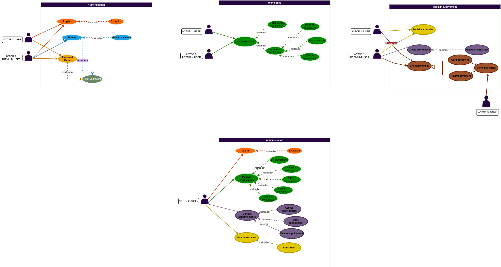
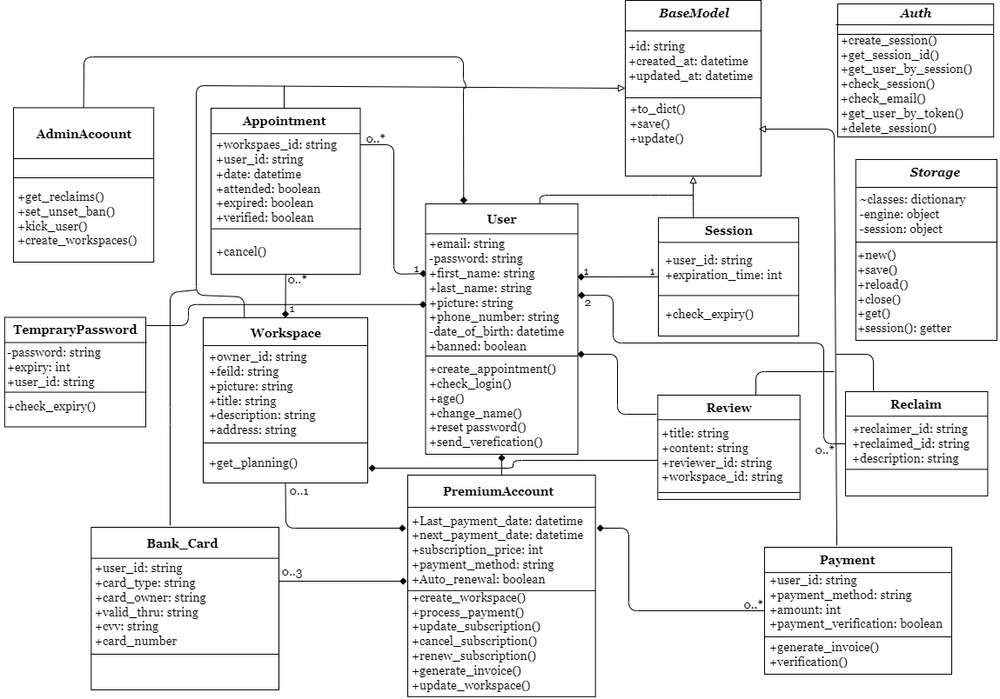
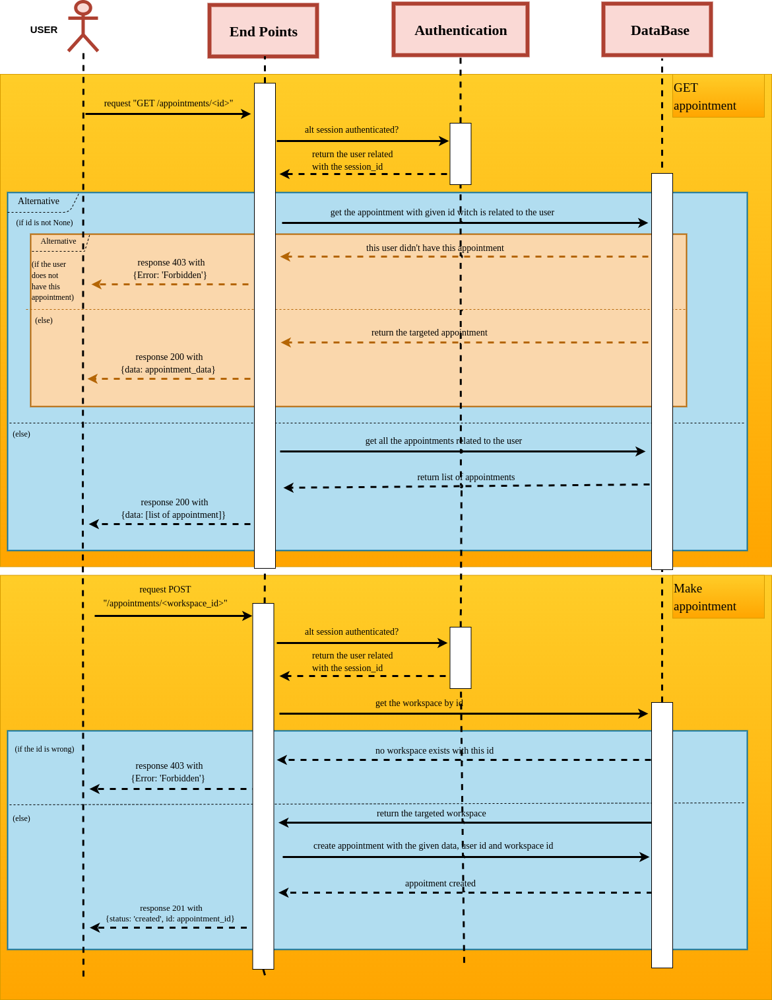
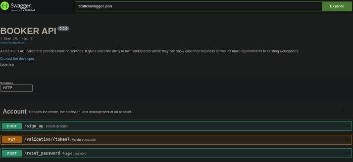

# BOOKER API


https://github.com/jinDeHao/Booker/assets/70861727/377e923d-5bc4-438e-b8b1-c4e12afb5068

## TABLE OF CONTENT
- [Booker explained](#booker-explained)
- [Inspiration](#booker-explained)
- [User stories](#user-stories)
- [Functional requirements](#functional-requirements)
- [Features](#features)
- [Technical specifications](#technical-specifications)
- [Modeling and conception](#modeling-and-conception)
- [Development](#development)
- [Clonning and setup](#clonning-and-setup)

## Booker explained

While a random person, in a random area, was struggling with a random illness, they decided to visit a random doctor to end the suffering. The trip to the clinic lasted about 2 hours, which made their health situation even worse.

When the person arrived, to their surprise, a long queue of people waiting to get an appointment to see the doctor, the person waited for what seemed like infinite time, then got an appointment, The person had to hit the road one more time back home until the appointment day.

This is a typical situation for getting an appointment, thus my partner and I decided to go on a journey to tackle the continuous problem. We introduce `BOOKER`.

Booker is a restful API, that provides booking services and allows industries to create working spaces where their clients can book appointments remotely.

Booker is amazing because it gives great developers around the world the chance to create an interface based on what they think fits their client's needs. The developers can take our API and use it for their purposes. The goal was to have an API with simple endpoints that handle different tasks done by the regular user that can create appointment, and the workspace owner where the appointments are done, as well as the administration that handles all the managment.

We see Booker as more than just a Restful API; we see it as the future, as it can be used in amazing inventions, and that’s the plan.

## User stories

> As a user, I want to be able to create a new booking or a workspace for my professional activities, view all my bookings and workspaces, update, cancel, or delete existing ones, and also search for available workplaces based on location, amenities, and availability.

> As a meticulous user, I want to receive confirmation emails for successful bookings.

> As a small business owner, I have been struggling to handle clients' requests since they call me on my mobile to book appointments. I haven’t been able to hire an assistant to handle that task for me since I have just started my business and am not yet able to afford to hire a new employee. With Booker, I pay an affordable monthly fee, and Booker handles client bookings for me. I have a dashboard where I can keep track of the appointments taken, and it gives me the flexibility and the freedom to focus on the work that I do and deliver the best service.

## Functional requirements
Booker provides booking services for users, and workspaces for different industries that occupy various fields.

- User authentication: Users can sign up and manage their accounts. For a user to have access to start creating workspaces, they have to check the final field and enter the payment information.
- User navigation: Users can navigate through available workspaces, filter based on their demand, and get appointments. Premium users have the right to create workspaces and personalize them based on their schedule and availability. There will be available templates that can be customized.
- Appointment: The user wanting to make an appointment can filter using multiple fields, and then select the proper date based on their availability.
- Developers: As working on creating a RESTFUL API, we will ensure that our endpoints are clear for developers to use no matter their level of understanding of the API.

## Technical specifications


## Features

- Authentication
	- Signing up
	- Loging in
	- Login out
- Account managment
	- Account validation
	- Account upgrade
	- Account deletion
- Profile managment
	- Showing profile
	- Updating profile
- Appointment managment
	- Creating appointments
	- Listing appointments
	- Canceling appointments
- Workspace managment
	- Creating workspace
	- Updating workspace
	- Deleting workspace
	- Listing workspaces
	- Filtering workspaces
- Reviews managment
	- Creating review
	- Updating review
	- Liking review
	- Disliking review
	- Deleting review
- Reclaims managment
	- Sending reclaim
	- Listing reclaims
- Administration
	- The administration is available for a couple of features so far, and it is under construction.

## Modeling and conception
We have chosed to use the UML (unified modeling language) since it is known for its fitted nature to the oriented object programming. It helped us alot to include this step, and in fact was crucial.

https://github.com/jinDeHao/Booker/assets/70861727/cfc5d3f0-e458-494f-a6ab-263fadfd7eea

You can access the UML folder and check out the diagrams saperatly and go trough each.

<center>
	<iframe width="200" height="300"
	src="https://www.youtube.com/shorts/Xez3T_irVOU" frameborder="0" allowfullscreen>
	</iframe>
</center>

With UML we were able to create different diagrams each fitted for a purpose starting with the `Use case diagram`.

#### Use case diagram



#### Class diagram



#### Sequence diagram
One example of the use case diagram would be post and get appointment.



## Development
We created end points for every feature. And we have used Swagger to show case every one of them.



## Clonning and setup
In order to test what we have created try to follow this guide:

Clonning the repository
```bash
git clone
```
Navigate to the project
```bash
cd /Booker/API/app
```

Install the required dependancies
```bash
./requirements.sh
```

Create the database and the user
```bash
./config.sh
```

Run the api
```bash
python3 -m run
```

<!-- <center>
	<iframe width="200" height="300"
	src="https://www.youtube.com/watch?v=eqWzKyfpXv0" frameborder="0" allowfullscreen>
	</iframe>
</center> -->

[](https://www.youtube.com/watch?v=eqWzKyfpXv0)
